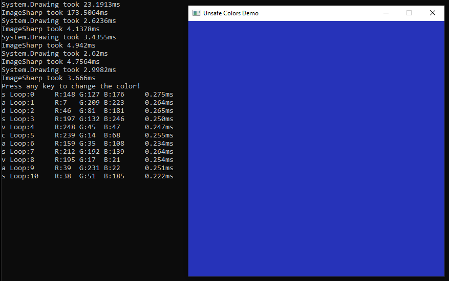

# UnsafeColors

### [Updating an image with a Color array pointer using Raylib](UnsafeColors/UnsafeColors/Program.cs)

- All byte arrays are treated as 32 bit data, so each pixel is 4 bytes
    - System.Drawing is ordered BGRA
    - ImageSharp is ordered RGBA
- Make sure unsafe code is turned on in the project settings
- App initialization hinders the first loop of image loading, so they are done 5 times
- Comparisons
    - System.Drawing vs ImageSharp
    - DrawPixel vs UpdateTexture
