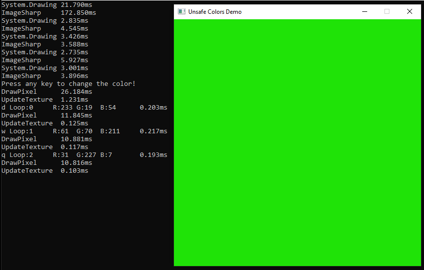

# UnsafeColors  
### [Updating an image with a Color array pointer using Raylib](UnsafeColors/UnsafeColors/Program.cs)  

Also, comparing the speed of System.Drawing and ImageSharp.  
The initialization of the program hinders performance, so the test functions are ran 5 times each.  

  

- All byte arrays are treated as 32 bit data, so each pixel is 4 bytes  
    - System.Drawing is ordered BGRA  
    - ImageSharp is ordered RGBA  
- Make sure unsafe code is turned on in the project settings  
